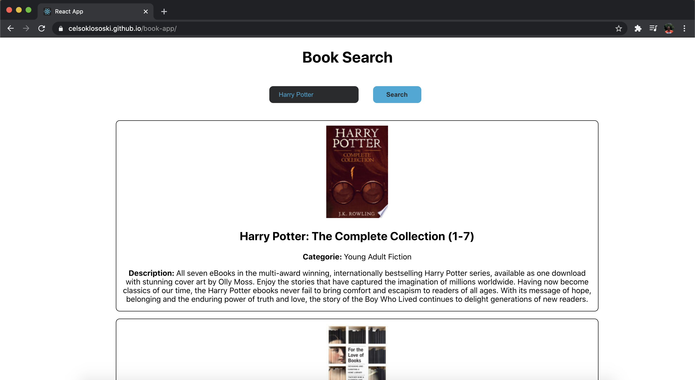

# Book Search App

Project developed during the React course held at the BCIT institution in the Applied Web Development program. The purpose of this project was to develop a book search application using the google books API.

